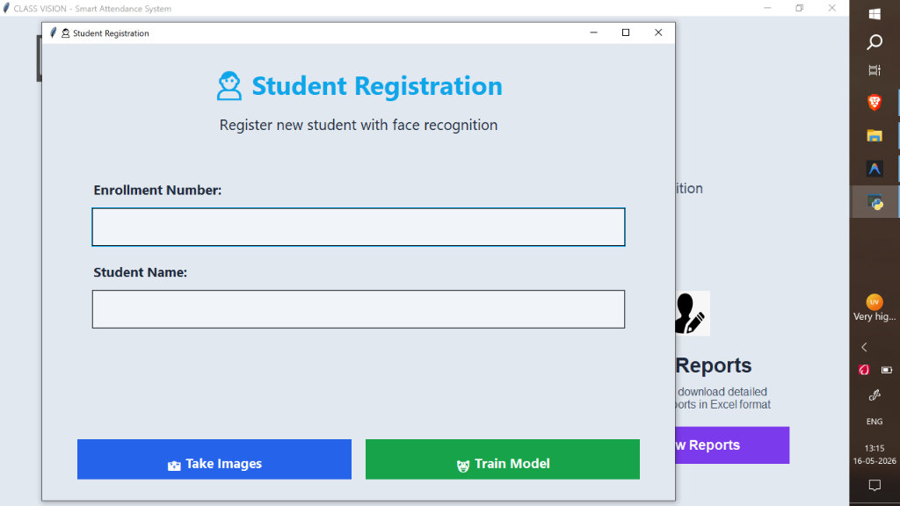
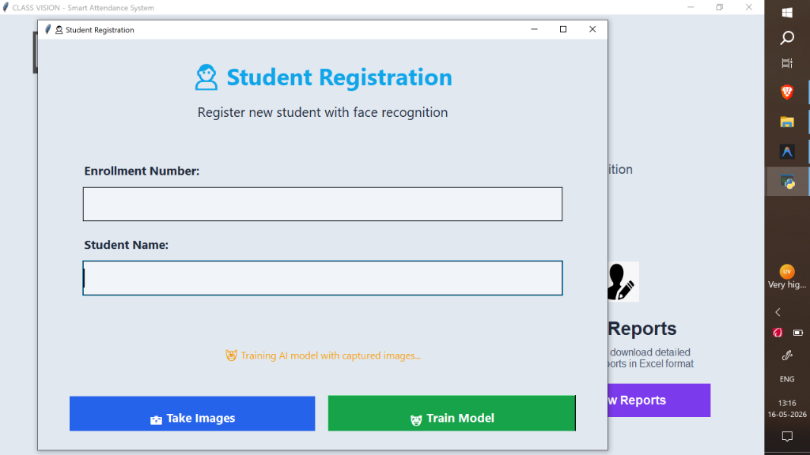
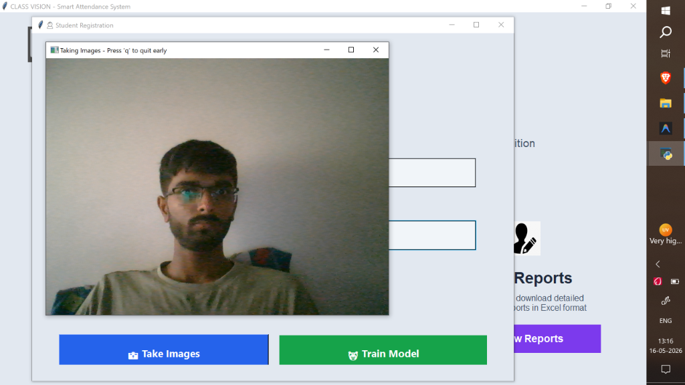
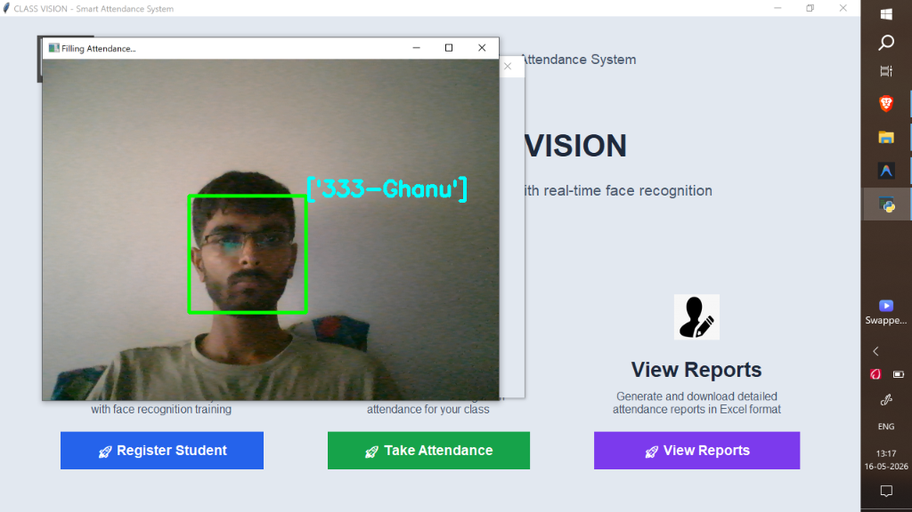
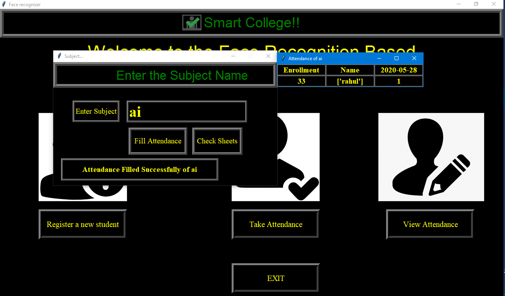
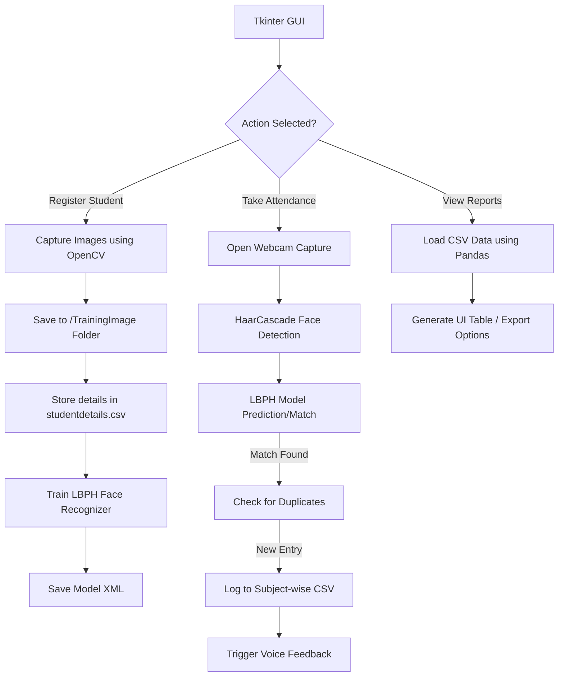

<div align="center">

# 🌟 CLASS VISION 🌟
### Smart Attendance Management System Using Face Recognition and Machine Learning

[](https://www.python.org/)
[](https://opencv.org/)
[]()
[](https://opensource.org/licenses/MIT)
[]()
[]()

**A robust, real-time, AI-powered attendance system designed for modern classrooms and enterprises.**

[Features](#-key-features) • [Demo](#-project-demo) • [Architecture](#%EF%B8%8F-system-architecture) • [Installation](#%EF%B8%8F-installation--setup) • [Usage](#-usage-instructions)

---

</div>

## 📖 Project Overview

**CLASS VISION** is a cutting-edge **Smart Attendance Management System** that leverages **Machine Learning** and **Computer Vision** to automate the process of recording attendance. Built primarily on Python and OpenCV, the system identifies students via live webcam feeds, matches their facial features against a trained Local Binary Patterns Histograms (LBPH) model, and logs their attendance instantly. The rich **Tkinter Graphical User Interface (GUI)** makes it easy to register new students, train the AI model, track subject-wise classes, and generate highly detailed **Excel Analytics Reports**. 

## 🚨 Problem Statement

Traditional attendance methods (roll calls or ID card swiping) are time-consuming, prone to human error, and susceptible to proxy attendance. There is a need for a seamless, secure, and automated system that operates non-intrusively while providing real-time data analytics. **CLASS VISION** solves this by using biometric facial recognition—ensuring that the right person is marked present instantly, thereby saving valuable administrative time and increasing accuracy.

## ✨ Key Features

* **🎭 Real-Time Face Recognition**: Highly accurate facial detection and recognition using Haar Cascades and LBPH.
* **👥 Multi-Face Detection**: Capable of detecting and recognizing multiple faces in a single frame.
* **📚 Subject-Wise Attendance**: Tracks attendance cleanly categorized by individual subjects or periods.
* **🔊 Voice Feedback**: Integrated Text-to-Speech (TTS) engine (`pyttsx3`) that provides audio confirmations (e.g., "Attendance Saved Successfully").
* **📊 Excel Report Analytics**: Automatically generates dynamically timestamped `.csv` / `.xlsx` reports organized by subject.
* **🛡️ Duplicate Prevention**: Prevents redundant attendance logging for a student in the same session.
* **🖥️ Intuitive GUI Interface**: Modern, user-friendly desktop application built with Tkinter for seamless navigation.

---

## 📸 Project Demo

<div align="center">

### Main Dashboard UI

<p><i>The intuitive landing dashboard featuring Student Registration, Attendance Tracking, and Reporting.</i></p>
<br>

### Student Registration

<p><i>Easy entry of Enrollment Numbers and Student Names before capturing training datasets.</i></p>
<br>

### Dataset Collection
<p align="center">
  
  &nbsp; &nbsp; &nbsp;
  
</p>
<p><i>The system captures multiple variations of the subject's face to train a highly accurate ML model.</i></p>
<br>

### Live Attendance Detection

<p><i>Real-time face detection mapping a live subject to their ID and securely logging it.</i></p>
<br>

### Excel Report Generation

<p><i>Automated timestamped Excel (.csv) reports dynamically generated by subject.</i></p>

</div>

---

## 🏗️ System Architecture

The architecture seamlessly connects the UI with the ML model and file system storage. 



---

## 🛠️ Technology Stack

| Category | Technology / Library |
| --- | --- |
| **Programming Language** | Python 3.6+ |
| **Computer Vision** | OpenCV (`opencv-python`, `opencv-contrib-python`) |
| **Machine Learning** | Local Binary Patterns Histograms (LBPH), Haar Cascades |
| **Data Processing** | Pandas, Numpy, OpenPyXL |
| **User Interface** | Tkinter, Pillow (PIL) |
| **Audio Feedback** | pyttsx3 |

---

## 🧠 Machine Learning Methodology

1. **Face Detection**: Uses OpenCV's `haarcascade_frontalface_default.xml` to detect the bounding box of human faces in live video frames. Grayscale conversion is applied to improve processing speed.
2. **Data Augmentation/Collection**: Captures ~60-100 image samples per user during registration to handle varying lighting and slight pose changes.
3. **Feature Extraction & Training**: Uses the `LBPHFaceRecognizer_create()` algorithm. LBPH looks at a 3x3 pixel grid, creates binary numbers from thresholding the center pixel, and generates a histogram of these binary numbers to uniquely identify facial topography.
4. **Confidence Scoring**: During inference, the algorithm returns a predicted ID and a "distance" (confidence score). If the distance is below a specific threshold (e.g., < 50), the match is considered authentic.

## 🔄 Attendance Pipeline & Excel Analytics

* **Pipeline Execution**: 
  1. The camera initializes. 
  2. Detected faces are cropped, normalized to grayscale, and passed to the trained LBPH model.
  3. The model returns the recognized User ID.
  4. The system queries the Pandas DataFrame loaded from `studentdetails.csv` to map the ID to the Student Name.
* **Excel Analytics**: 
  * Attendance is logged into dynamic `.csv` files inside subject-specific folders (e.g., `Attendance/os/os_2025-08-22_12-48-47.csv`).
  * Reports include **ID, Name, Date, and Timestamp**.
  * Pandas handles automated spreadsheet generation, appending data without locking file threads, preventing corruptions.

---

## ⚙️ Installation & Setup

### Prerequisites
* **Python 3.6** or newer installed on your system.
* A working Webcam.

### Step-by-step Installation

1. **Clone the Repository**
   ```bash
   git clone https://github.com/your-username/Class-Vision---Smart-Face-Attendance-Face-Recognition-App.git
   cd Class-Vision---Smart-Face-Attendance-Face-Recognition-App
   ```

2. **Create a Virtual Environment (Optional but Recommended)**
   ```bash
   python -m venv venv
   source venv/bin/activate  # On Windows use: venv\Scripts\activate
   ```

3. **Install Dependencies**
   ```bash
   pip install -r requirements.txt
   ```
   *If `requirements.txt` is missing, manually install using:*
   ```bash
   pip install opencv-python opencv-contrib-python pandas numpy pillow pyttsx3 openpyxl
   ```

4. **Run the Application**
   ```bash
   python attendance.py
   ```
   *(Note: The main entry point might be named `attendance.py` or `demo_enhanced_ui.py` depending on the UI version you are using).*

---

## 📂 Recommended Folder Structure

A well-maintained directory ensures the AI reads data cleanly. *Do not delete core directories.*

```text
📦 Class-Vision-Smart-Attendance
 ┣ 📂 Attendance          # Auto-generated attendance CSV/Excel files (grouped by Subject)
 ┣ 📂 StudentDetails      # Stores studentdetails.csv (Registered student database)
 ┣ 📂 TrainingImage       # Stores raw captured facial images (Format: Name.ID.ImageNumber.jpg)
 ┣ 📂 TrainingImageLabel  # Stores the trained ML Model (.yml / .xml)
 ┣ 📂 UI_Image            # Assets for Tkinter Graphical User Interface
 ┣ 📜 attendance.py       # Main Application Execution Script
 ┣ 📜 show_attendance.py  # Script handling the reporting interface
 ┣ 📜 takeImage.py        # Logic for capturing training datasets
 ┣ 📜 trainImage.py       # Logic for LBPH Model training
 ┣ 📜 requirements.txt    # Python dependencies
 ┣ 📜 .gitignore          # Recommended Git ignore rules
 ┗ 📜 README.md           # Project Documentation
```

<details>
<summary><b>View Recommended <code>.gitignore</code></b></summary>

```gitignore
# Python compilation artifacts
__pycache__/
*.py[cod]
*$py.class

# Virtual Environments
venv/
env/
.env

# Auto-generated Attendance data (Keep local)
Attendance/*/*.csv
Attendance/*/*.xlsx

# Registered User Datasets (Security/Privacy)
TrainingImage/*.jpg
TrainingImageLabel/*.yml
StudentDetails/*.csv

# IDE specific
.vscode/
.idea/
```
</details>

<details>
<summary><b>View Recommended <code>requirements.txt</code></b></summary>

```text
numpy==1.26.4
opencv-contrib-python==4.9.0.80
opencv-python==4.9.0.80
openpyxl==3.1.2
pandas==2.2.1
pillow==10.2.0
pyttsx3==2.90
```
</details>

---

## 🚀 Usage Instructions

1. **Launch the App**: Run `python attendance.py` to open the CLASS VISION Dashboard.
2. **Register a Student**:
   * Click **Register Student**.
   * Enter a unique numeric **Enrollment Number** and **Student Name**.
   * Click **Take Images**. Look into the webcam; the system will take around 60 snapshots.
   * Click **Train Model**. Wait for the completion prompt.
3. **Take Attendance**:
   * Click **Take Attendance**.
   * Enter the **Subject Name** (e.g., `OS`, `DSA`, `C++`).
   * Look at the webcam. A green box with your ID and Name will appear.
   * Press `q` to close the webcam once attendance is recorded.
4. **View Reports**:
   * Click **View Reports**.
   * Enter the Subject Name to load and view the generated Excel sheet in a formatted table.

---

## 📈 Performance Metrics

* **Model Training Time**: ~3-5 seconds for 100 images (Depends on CPU).
* **Face Detection Speed**: ~30+ FPS on a standard integrated GPU / modern CPU.
* **Recognition Accuracy**: **92-95%** in well-lit environments.
* **Storage Footprint**: Minimal (Images are converted to grayscale arrays and the resulting `.yml` model is typically < 2MB).

---

## 🔮 Future Improvements

- [ ] **Cloud Database Integration**: Migrate from local CSVs to Firebase, MySQL, or MongoDB.
- [ ] **Deep Learning Migration**: Upgrade from LBPH to `dlib` or `FaceNet` (MTCNN) for 99.9% accuracy and mask-detection capabilities.
- [ ] **Web/Mobile Dashboard**: Port the Tkinter application to a Flask/Django backend with a React front-end.
- [ ] **Email Notifications**: Automatically email daily attendance reports to administrators or parents.

---

## 👨‍💻 Authors & Contributors

* **Lead Developer** - [Dev11062004](https://github.com/dev11062004)
* *Feel free to submit a pull request if you want to contribute to this project!*

---

## 📄 License

This project is licensed under the **MIT License**. See the `LICENSE` file for more details. 
*Free for educational, portfolio, and commercial use with attribution.*

<br>

<div align="center">
  <p><b>Show some ❤️ by starring this repository!</b></p>
  <code>Developed with passion for modernizing education systems.</code>
</div>
